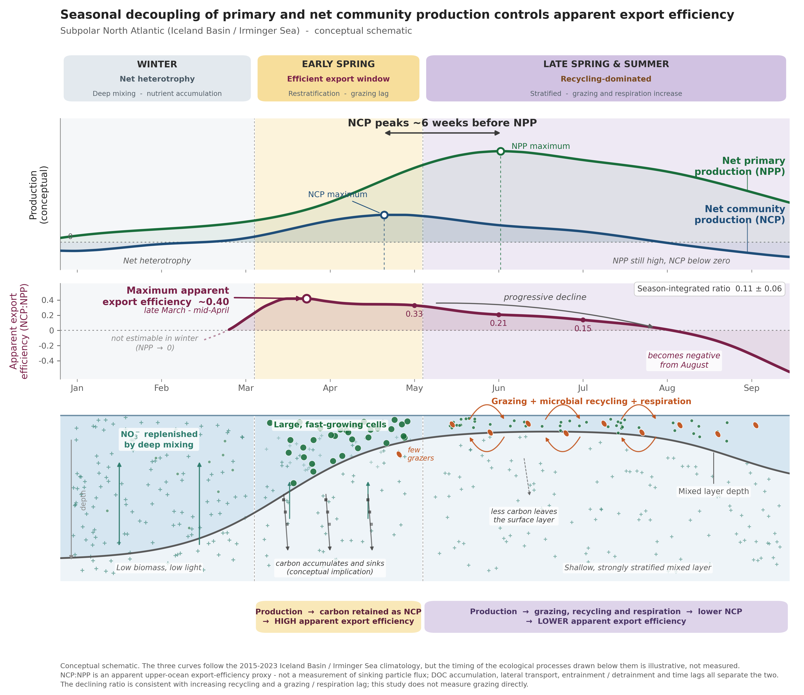

# Productivity estimates — subpolar North Atlantic

Ocean productivity of the Iceland Basin / Irminger Sea (lon −40..−10, lat 58..65) estimated
from BGC-Argo floats, the ALR6 glider, DY180 CTD casts and satellite / CMEMS products,
2015–2025.

Three independent quantities are computed and compared:

| Quantity | Method | Implementation |
|---|---|---|
| **NPP** — net primary production | Carbon-based Productivity Model (CbPM, Westberry et al. 2008) from chla + bbp-derived Cphyto | [`Scripts/cbpm_py/`](Scripts/cbpm_py/) and [`Scripts/cbpm_r/`](Scripts/cbpm_r/) (kept in sync) |
| **NCP** — net community production | Seasonal nitrate drawdown on CANYON-B-corrected profiles, with entrainment | [`Scripts/ncp_function.R`](Scripts/ncp_function.R) |
| **GOP** — gross oxygen production | Mixed-layer O₂ budget (net and night-time rates), air–sea corrected (float 3902681) | [`Scripts/o2_budget_3902681*.R`](Scripts/) |

## Main result



NCP peaks ~6 weeks before NPP. The apparent export efficiency (NCP:NPP) is highest
(~0.40) in a narrow early-spring window — restratified, grazing still lagging — then
declines through the stratified summer as recycling takes over, turning negative from
August. Season-integrated ratio: **0.11 ± 0.06**.

Figure: [`Scripts/conceptual_seasonal_decoupling_figure.py`](Scripts/conceptual_seasonal_decoupling_figure.py).
Curve shapes come from the 2015–2023 climatology in
`Output/IcelandIrminger_2015_2025/eratio_doy_stats.csv`; the schematic asserts timing and
relative amplitude only.

## Layout

```
Scripts/        R + Python pipelines and figure scripts (run from the repo root)
  cbpm_r/ cbpm_py/   the two parallel CbPM implementations
  batch/            JASMIN Slurm templates
Data/           gitignored — Raw/ Intermediate/ Processed/
Output/         figures and derived CSV/XLSX (mostly gitignored)
```

Ingestion path: `Sprof.nc` → per-float CSV ([`sprof_to_csv.R`](Scripts/sprof_to_csv.R)) →
nitrate offset correction ([`nitrate_correction.R`](Scripts/nitrate_correction.R)) →
density, bbp despike, Cphyto, CbPM ([`format_for_ncp.R`](Scripts/format_for_ncp.R)) →
NCP / NPP time series and figures.

## Running

```powershell
# R — use 4.5.2, always from the repo root (scripts source with relative paths)
& "C:\Program Files\R\R-4.5.2\bin\Rscript.exe" Scripts/<script>.R

# Python figures
& "C:/Users/petit/anaconda3/envs/cmts_learn_olci/python.exe" Scripts/<figure>.py
```

No build, no test suite: scripts are run interactively, figures verified by eye.

## Conventions

- CbPM expects profiles regularised to **200 levels at 1 m** (0–199 m); `zeu_default = 40 m`.
- NCP integration window defaults to **15 days**; 5/10/15/20-day sensitivity is the standard plot.
- CMEMS NPP has **no winter output** (Nov–Jan light gap) — rendered as "not estimated", never zero.
- Watch the CSV separator: multiyear DOXY DB files are `read_csv2` (semicolon).

## Further reading

- [`CLAUDE.md`](CLAUDE.md) — full repo conventions, gotchas, scientific constants.
- [`METHODS_seasonal_reproducibility.md`](METHODS_seasonal_reproducibility.md) — the R²/slope
  seasonal-reproducibility method note.
- [`REVIEW.md`](REVIEW.md) and [`FIGURE_HANDOFF.md`](FIGURE_HANDOFF.md) — figure review and
  the tasks derived from it.
